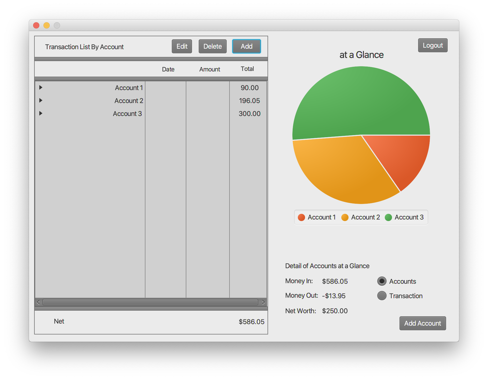
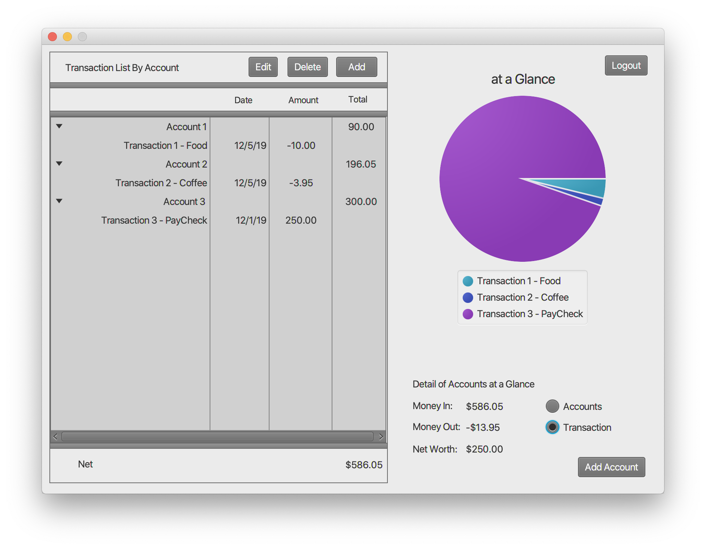

# Plain Ordinary and Simple Banking Software
A simple application to track personal accounts and purchases, aggregating these into a clean graphical format that breaks down the flow of money to help you make better finacial decisions for your future.
## Getting Started

These instructions will get you a copy of the project up and running on your local machine for development and testing purposes. Eclipse is needed to build and run project.


### Downloading

First clone git repository into desired directory

```
git clone https://github.com/scottcalebc/BankSoftware.git
```

After cloning into directory open Eclipse and select
*File > Import > Existing Projects into Workspace*

Then browse and navigate to the directory in which you cloned the git repository and select folder *POSBankSoftware*

Select finish

## Running

Simply Run Project from Eclipse to load application

## Testing

This is a test account pre-loaded with *username*:username *password*:password. Logging in with these credentials shows example accounts and transactions to edit or delete or add new ones.

* To Edit an Account or Transaction
    * Select the Account or Transaction from the table on the left and press the Edit Button

* To Delete an Account or Transaction
    * Select the Account or Transaction from the table on the left and press the Delete Button

* To View Accounts or Transactions with Pie Chart
    * Select the respective radio button on the bottom-right hand side of screen

## Examples
This shows the main view with the test accounts


This shows the main view with the test transactions


### Features
* Create User(s)
* Add/Edit/Delete Accounts
* Add/Edit/Delete Transactions

## Built With

* [JavaFX](https://docs.oracle.com/javase/8/javafx/get-started-tutorial/jfx-overview.htm) - The Window framework used
* [Eclipse](https://www.eclipse.org) - IDE used

## Authors
* Christopher Caleb Scott
* Nikki Thanapaisal
* Jonathan Becker
* Luke DeGoes
* Brenna Lusk
